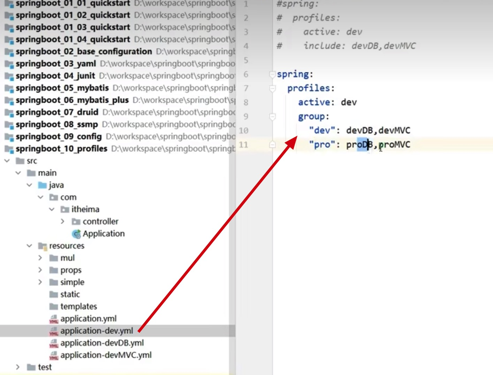

# spring-boot

## 注解

#java/注解

- Component, Service, Repository, Controller：这些注解用于声明一个类为 Spring 管理的 bean。Component 是通用的 bean 注解，而 Service、Repository 和 Controller 则分别用于业务逻辑层、数据访问层和 Web 层。 当类使用了 Component 注解，Spring 会自动将这个类注册为一个 Spring Bean，即 Spring 会自动创建这个类的实例并管理它的生命周期。
- Autowired：用于依赖注入，一般用于引用类型注入，可以用于字段、构造函数和方法。
- Qualifier：指定名称，用于在多个相同类型的 bean 中指定要注入哪一个。 必须跟 Autowired 配合使用。
- Primary：用于在多个相同类型的 bean 中指定默认要注入哪一个。
- Value: 注入简单类型，或者说值类型的，可以用来获取 yml 中的配置， @Value("${server.port}")。
- Scope：用于指定 bean 的作用域，如 singleton、prototype、request、session 等。 默认为 singleton。
- Lazy：用于延迟加载 bean，即在第一次使用时才初始化。
- PostConstruct 生命周期注解，等于 init，在构造函数执行后执行，指定在 bean 初始化后要执行的方法。
- PreDestroy 生命周期注解，等于 destroy，在销毁前执行，指定在 bean 销毁前要执行的方法。
- Configuration：用于声明一个类为配置类，可以替代 XML 配置。
- ComponentScan 设定扫描路径，指定 Spring 要扫描的包路径。只能使用一次。找到并注册带有 Component、Service、Repository、\@Controller 等注解的类，将它们加入 IoC 容器。用于定义哪些包下的类应该自动加载为 Spring Bean，实现组件的自动扫描和依赖注入。与上面的配置类注解一起使用。
- Bean：用于在配置类中声明一个 bean。 一般用来配置第三方的 Bean
- Import：用于导入其他配置类或 bean 定义。 往往是有多个配置类时，在主配置类上使用，传入其他配置类.class。只允许使用一次，如有多个参数使用数组传递。
- Profile：用于指定在特定的环境配置下使用。
- Aspect：用于声明一个切面（Aspect），用于实现 AOP（面向切面编程）。
- Pointcut：用于声明一个切点（Pointcut），用于指定 AOP 的执行点。
- Before, After, AfterReturning, AfterThrowing：用于声明 AOP 的前置、后置、返回后和抛出异常后通知。
- Cacheable, CachePut, CacheEvict：用于实现缓存功能。
- ResponseBody：表示该方法，类的返回值直接写入 HTTP response body 中。
- RestController：复合注解，是 Controller 和 ResponseBody 的结合。

[!images]('./imgs/注解与xml.png')

## boot 如何做到简化 spring 开发的

### maven —— pom.xml 中的配置解析

- parent：定义 spring-boot 项目要继承的东西，预定义了许多依赖的版本号，目的是为了**减少依赖版本冲突**。
- starter：可以理解为依赖集合，只需要引入一个技术的 starter 依赖，内部会自动引入这一个技术的所有必需依赖，目的是为了**减少依赖配置**。

在实际开发时，只需要在项目中定义依赖的 G, A ，V 交给 parent 自动配置。只有在引入的依赖不在 parent 中定义时，才需要手动写上 V

### 引导类

引导类就是在 spring-boot java 根目录下的那个类，也就是入口类。这个类只提供了一个 psvm 函数，内部调用了 SpringApplication.run() 方法，生成了一个 sping 的容器，这个函数会返回上下文对象。

引导类的作用就是加载 Bean。

引导类上面有一个 @SpringBootApplication 注解，默认会扫描引导类所在包及其子包的所有类，加载 Bean。

### 辅助功能

内嵌 tomcat。spring-boot 内嵌了三种服务器定义。 tomcat, jetty, undertow 。 默认都用 tomcat。

tomcat 是用 java 语言编写的一款服务器，所以 tomcat 的运行也是通过对象来执行的。sprint-boot 通过将 tomcat 对象内嵌到自身的容器中，就可以达到内嵌 tomcat 服务，统一管理的目的。而不是需要通过启动 tomcat 服务器来跑 spring-boot 程序。

## 临时属性

一般而言，我们在开发 java 项目时， 配置文件都是写在 application.yml 配置中。但是我们在命令行中启动 java 时，可以在启动命令后添加 --xx=bb yy=mm 这种方式来添加临时属性，从而覆盖 application.yml 配置。

临时属性中所配置的属性，最终会通过入口类中的 main(String[] args) 函数的 args 传递。如果我们不想外部临时属性影响到我们的项目的话，只需要把 args 项目不传就行。

## 四层配置

为了方便开发人员，项目经理，以及运维的使用，spring-boot 项目有四层优先级配置，方便不同人员进行配置管理，不需要在一个文件中进行修改。这四层配置从高到低分别是：

1. 项目打包后的 jar 包所在目录的 config/application.yml 运维使用
2. 项目打包后的 jar 包所在目录的 application.yml 运维使用
3. 项目 resources/config/application.yml 项目管理者使用
4. 项目 resources/application.yml 开发使用

## 多环境配置文件

spring 项目中如果要为多个环境（dev，st，uat，prd）设置不同的配置，则需要创建不同环境下的配置文件。

在 resources 目录下创建：

- application.yml
- application-dev.yml
- application-st.yml
- application-uat.yml
- application-prd.yml

将环境冲突的配置分别设置在不同的配置文件中，将公共配置放在 application.yml 中。

需要切换环境时，只需要修改 application.yml 中 spring.profiles.active: dev/st/uat/prd 就行。

### 多环境配置文件分组

在 spring-boot 项目中，还可以更细粒度的划分配置文件，方便线上管理。然后通过 group 属性(2.4 版本之后，之前使用 include)来设定激活配置。如下图：

需要注意的是，group 中的配置，如果有相同配置，是后面的文件中的配置覆盖前面文件中的配置。
