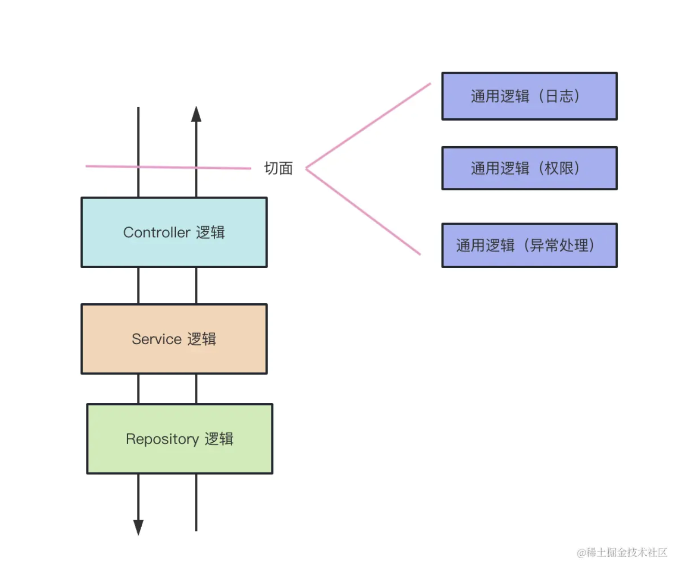

# AOP 以及 nest 中使用 AOP 方式调用的中间件

## AOP

AOP 面向切面编程，指的是在入口或出口处，通过一种统一的拦截方式去处理一些公共逻辑。这种方式不会影响到业务逻辑，也不会与业务逻辑糅合在一起。



## middleware

nest 的 middleware 继承于 express。全局 middleware 的用法跟 express 中的 middleware 没有太大区别。

局部作用域的使用方式需要需要注意，是写在 module 模块文件中的。

```typescript
export class AppModule implements NestModule {
  configure(consumer: MiddlewareConsumer) {
    consumer.apply(xxxMiddleware).forRoutes('cats')
  }
}
```

## guard

对某个 controller 执行前判断是否有权限，返回 true 或 false 判断是否能够执行对应的 controller。

作用范围：可以用在单独的 controller 上，也可以用在全局。

## interceptor

对某个 controller 执行前和执行后做一些操作。

作用范围：可以用在单独的 controller 上，也可以用在全局。

### @UseFilters

@UseFilters 用于处理未捕获的异常，需要与 @Catch 配合使用。使用方式是：

```ts
// filter.ts
// AbcFilter 实现 ExceptionFilter 接口，再通过 @Catch 装饰想要捕获的异常
@Catch(HttpException)
export class AbcFilter implements ExceptionFilter {
  catch(exception: HttpException, host: ArgumentsHost) {
    const response: Response = host.switchToHttp().getResponse()
    response.status(exception.getStatus()).json({
      msg: exception.message
    })
  }
}

// controller.ts
@Controller()
export class AppController {
  @Inject(AppService)
  private readonly appService: AppService

  @Get()
  // 在方法上使用注册的 filter 去处理 HttpException 异常
  @UseFilters(AbcFilter)
  getHello(): string {
    throw new HttpException('xxx', HttpStatus.BAD_REQUEST)
  }
}
```

## pipe

对参数进行一些校验和转换操作。

作用范围：可以对单个参数生效，可以用在单独的 controller 上，也可以用在全局。

## exceptionFilter

对抛出的异常做处理。

作用范围：可以用在单独的 controller 上，也可以用在全局。
