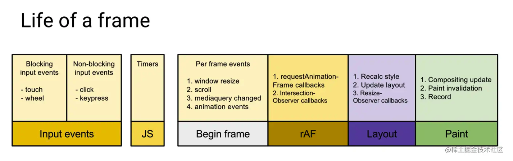

# requestAnimationFrame

在浏览器重新渲染页面前提供一个时机去做一些事情。



## 执行次数

通常是 1 秒 60 次，也就是 60 帧（60fps）。但大多数遵循 W3C 标准的浏览器，**执行次数与浏览器屏幕刷新次数一致**。所以，刷新率越高的屏幕，浏览器执行 requestAnimationFrame 的次数越多。

所以我们需要在 requestAnimationFrame 的回调中去控制执行次数。

```js
let count = 0,
  previousTimeStamp = 0
function animation(timestamp) {
  if (count > 200) return

  const elapsed = timestamp - previousTimeStamp
  // 判断时差，两帧执行一次
  if (elapsed > 30) {
    test.style.marginLeft = `${count}px`
    count++
    previousTimeStamp = timestamp
    console.log(elapsed)
  }

  requestAnimationFrame(animation)
}

requestAnimationFrame(animation)
```

## 缺点

页面在后台时/在隐藏的 iframe 中，浏览器会减少或暂停调用 requestAnimationFrame。
