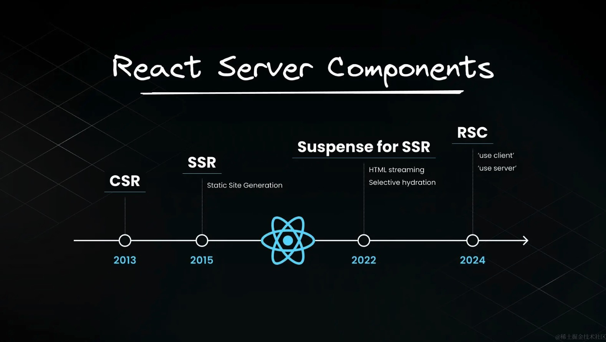

# Next 渲染篇

## 几种渲染方式

web页面渲染分为以下几种方式：

1. CSR（客户端渲染）
2. SSR（服务端渲染）
3. SSG（静态站点生成）
4. ISR（增量静态再生）

都是支持混合使用的。

### CSR
### SSR
### SSG
### ISR

## 服务端渲染策略

1. 静态渲染
2. 动态渲染
3. streaming

### 静态渲染

页面在构建时就已经决定了渲染内容，并且会被标记成 `static content`。又或者在 revalidate 重新验证之后会重新渲染，但在 revalidate 时限内不会重新渲染。

> 需要注意的是，超过 revalidate 期限后的首次请求，还是会返回缓存的原来的页面，但这次请求会促使服务端重新渲染页面  
> 在第二次请求才会返回新页面

### 动态渲染

页面使用了动态参数时，又或者页面未缓存时都会构建成动态渲染。

动态参数包括：

1. cookies()
2. headers()
3. searchParams

设置页面请求不缓存的方法包括：

1. fetch 请求添加了 cache: 'no-store'选项 
2. fetch 请求添加了 revalidate: 0选项 
3. fetch 请求在路由处理程序中并使用了 POST 方法 
4. 在headers 或 cookies 方法之后使用 fetch请求 
5. 配置了路由段选项 const dynamic = 'force-dynamic' 
6. 配置了路由段选项fetchCache ，默认会跳过缓存 
7. fetch 请求使用了 Authorization或者 Cookie请求头，并且在组件树中其上方还有一个未缓存的请求

> 需要注意的一点是，即便页面是动态渲染，但是如果页面中的请求被缓存了，缓存部分也是不会更新的。

### 其他术语

1. 局部渲染：父级路由部分不渲染，只会重新渲染子级路由部分。举例说明，现在有 A/B 与 A/C 两个路由，当从 A/B 跳转到 A/C 的时候，A部分不会重新渲染，只有 B,C的部分重新渲染了。
2. 动态路由：也叫动态渲染的路由，也就是 /a/[id]/c。与之相对的就是静态渲染的路由。
3. 动态段：也就是动态路由的 [id] 这个部分。

### streaming

当配置了 loading 页面，或者在组件中使用了 suspense 组件时，就会开启 streaming 流模式

## 服务端组件可以直接导入客户端组件，但客户端组件并不能导入服务端组件

客户端中不能导入服务端组件，很好理解，如果在服务端组件中使用了诸如 Node API 等，该组件如果又导入到客户端组件中，渲染肯定会报错。

而服务端组件中为什么可以导入客户端组件呢？因为客户端组件在服务端渲染是渲染成占位符（占位符中会包含 useState 的基础状态），
客户端组件中假如说使用了浏览器端的api，也只会在 js 下载到浏览器上才会执行。

### 客户端组件如果想渲染服务端子组件有什么解决方法吗？

有，通过 children 传递服务端组件就行。