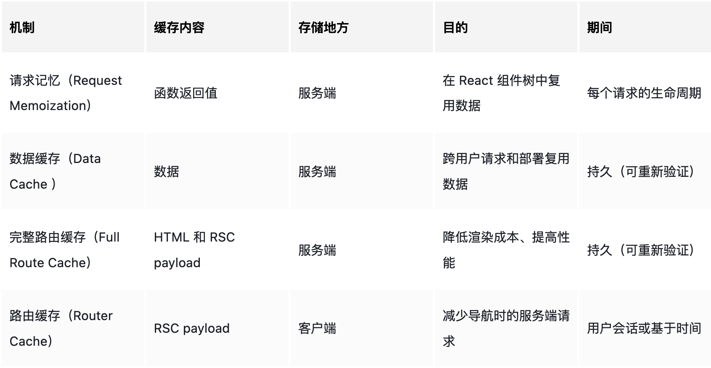

# Next 请求篇

## 数据获取

### Server Action


## 缓存

Next 缓存一共有4种，从 s 端到 c 端的依次生效顺序是：

1. 数据缓存
2. 请求记忆
3. 完整路由缓存
4. 路由缓存

其中，只有路由缓存是存在 c 端， 其余缓存都是存在 s 端。



页面方面缓存：路由缓存，完整路由缓存
数据方面缓存：请求记忆，数据缓存

### 数据缓存

#### 原理

数据缓存是由 next 实现的，拓展了 fetch api 。

#### 作用范围

默认情况下，使用 fetch 的请求数据都会被缓存。

#### 持续时间

**持久缓存**，数据缓存在传入请求和部署中（重新部署不会清除缓存）都保持不变，除非重新验证或者选择退出。

#### 解决场景

跨用户请求和部署复用数据。利用缓存提高性能。

#### 重新验证

1. 按校验时间退出
   - revalidate: 设置缓存时间，当超出时间后的第一次请求会返回缓存，并使服务器重新生成数据，以便后续请求使用新数据。
2. 手动校验退出
   - revalidatePath: 通过手动清除路径缓存，使下次请求使用新数据。
   - revalidateTag: 通过手动清除 tag 缓存，使下次请求使用新数据。

```js
// revalidate
revalidatePath('/')

// revalidateTag
fetch(`https://...`, { next: { tags: ['a', 'b', 'c'] } })
// 重新验证具有某一标签的请求
revalidateTag('a')

```

#### 退出方式

```js
// 针对单个请求
fetch(`https://...`, { cache: 'no-store' })

// 针对整个路由段
export const dynamic = 'force-dynamic'
```

### 请求记忆

#### 原理

请求记忆是由 react 实现的。原理是[函数记忆](https://juejin.cn/post/6844903494256705543)，也就是对相同参数的函数返回结果做缓存处理。

#### 作用范围

请求记忆只对 **fetch get** 请求生效。

#### 持续时间

请求记忆只存在页面渲染期间，当页面渲染完成后就会删除。

#### 解决场景

在 React 组件树中复用数据。

请求记忆**解决的场景**是，当组件树在渲染时，如果上下游或者其他 next 功能函数（e.g. generateMetaData，generateStaticParams）中有发起相同请求时，
**只会请求一次，剩余多次都会走缓存**。减少多次请求带来的性能问题。

这样做的**好处**是，不需要在页面或者组件顶层请求数据然后通过 props 透传。（ps：因为是服务端组件，也用不了 context 等数据存储技术。）

#### 重新验证

只在渲染期间使用，无需重新验证

#### 退出方式

如果需要退出请求记忆（不推荐），则可以按如下代码的方式使用：

```js
const { signal } = new AbortController()
fetch(url, { signal })
```

### 完整路由缓存

#### 原理

next 路由在被访问时会生成对应的 rsc 和 html 。路由缓存就是缓存这俩东西。

#### 作用范围

只对静态渲染生效。

#### 持续时间

持久缓存。除非重新部署（数据缓存可以跨部署，而完整路由缓存不行）和重新校验数据（数据变了页面也会变）。

#### 解决场景

降低渲染成本、提高性能。跨用户复用页面，利用缓存提高性能。

#### 失效方式

1. 重新部署
2. 重新验证数据

#### 退出方式

将静态渲染转为动态渲染。

### 路由缓存

#### 原理

将 rsc 存到 c 端。

#### 作用范围

不仅会缓存访问过的路由，还会进行预缓存，默认会缓存页面中 Link 上配置的路由段（Link 上的 prefetch 默认为 true）

#### 持续时间

会受两个因素影响（什么意思？）

session:：缓存在导航时生效，刷新失效。
自动失效期：静态路由，prefetch={true} 预加载 5 min。动态路由，prefetch={null} 不预加载 30s。

#### 解决场景

减少请求，提高性能。

#### 失效方式

1. 通过 revalidatePath 或 revalidateTag重新验证数据
2. 更新 cookie，set 或者 delete
3. router.refresh

#### 退出方式

无法退出