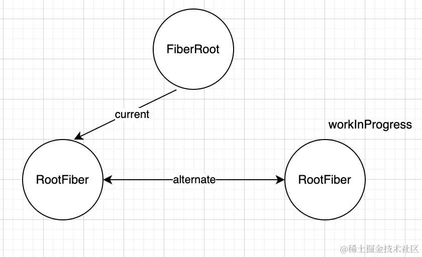
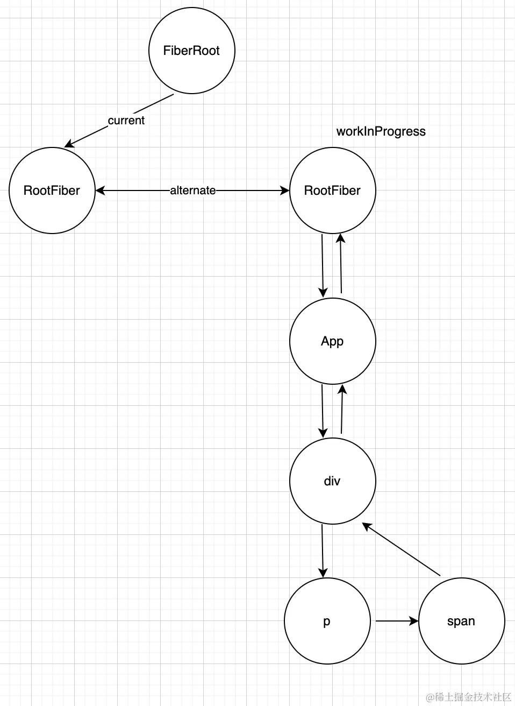
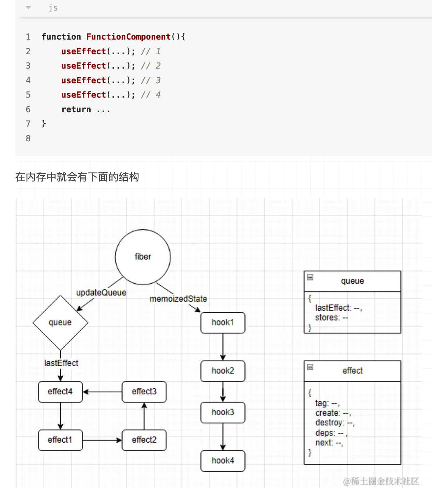

# react 学习笔记

## ReactElement 生成 vdom 时，$$typeof 的作用是什么

作用有两个：

1. 标记节点类型
2. 安全考虑。因为 $$typeof 是一个 react 内部生成的 Symbol 属性。

比如说如下代码：

```jsx
function Hi() {
  const data = await DataFromBackend();
  return <div>{data.msg}</div>
}
```

后端返回的 msg 是一个字符串，但受到了 xss 攻击，返回的是伪造的元素，这时候因为 $$typeof 不存在或者不合规，react 就不会渲染这个元素。从而保证了安全性。

### 节点类型

组件和元素都是 REACT_ELEMENT_TYPE 类型

React.StrictMode 也是一个组件，所以它的 $$typeof 也是 REACT_ELEMENT_TYPE。

## react 元素和组件的区别

在 React 中。React 元素指的是 jsx 的**产物**，也就是 vdom。而组件，指的是**组件函数、组件类**。

当我们在 react 编写 `<Abc>` 这样的代码时，它会被 babel 编译成 `React.createElement()` 函数调用（v18 后是 jsx）。最终函数调用会生成 React 元素，即 vdom。

所以我们可以把 `<Abc>` 这种类 html 的写法看做是 `Abc()`就行。

```jsx
// 所以在 react 中 插槽slot 可以这样写

// 传入的是 react 元素
function Parent({ son }) {
  return <div>{son}</div>
}

function Son() {
  return <div>son</div>
}

;<Parent son={<Son />} />
```

```jsx
// 作用域插槽scopedSLot可以这样写

function Parent({ Son }) {
  const [name] = useState('name')
  return (
    <div>
      <Son name={name} />
    </div>
  )
}

function Son({ name }) {
  return <div>{name}</div>
}

;<Parent Son={Son} />
```

```jsx
// 作用域插槽scopedSLot还可以这样写
// 这种写法也被叫做 render props
// 这其实是一种高阶组件

function Parent({ renderSon }) {
  const [name] = useState('name')
  return <div>{renderSon(name)}</div>
}

function Son({ name }) {
  return <div>{name}</div>
}

;<Parent
  renderSon={(name) => {
    return <Son name={name} />
  }}
/>
```

```jsx
// 当然，放在 children 中也是可以的
function Parent({ children }) {
  const [name] = useState('name')
  return <div>{children(name)}</div>
}

function Son({ name }) {
  return <div>{name}</div>
}

;<Parent>
  {(name) => {
    return <Son name={name} />
  }}
</Parent>
```

## 从初始化开始， React.createRoot() 做了什么工作

在 `React.createRoot()` 中主要做了两件事：

1. 创建 react app 根实例 FiberRootNode ，虚拟 fiberNode HostRoot。
2. 通过事件委托，在 #app 上绑定所有划分好优先级的事件。

### 创建 react app 根实例

react app 根实例 是一个全局唯一实例，用于切换两棵 fiber tree。可以理解为保存 fiber 树的容器

react app 根实例的 current 属性会绑定虚拟 fiberNode（ HostRootFiber ），而虚拟 fiberNode （ HostRootFiber ）的 stateNode 则会绑定 react app 根实例。

```js
FiberRootNode.containerInfo = #root
FiberRootNode.current = HostRootFiber

HostRootFiber.stateNode = FiberRootNode
```

FiberRootNode 并发模式下 tag 是 ConcurrentRoot = 1，通过 React.createRoot 来执行 react ，默认都是 并发模式。如果是传统模式的话，则是 LegacyRoot = 0。

HostRootFiber tag 是 HostRoot = 3。

函数组件类型 FunctionComponent = 0，类组件类型 ClassComponent = 1 虽然 ConcurrentRoot 和 LegacyRoot 与它俩的值相同，但是 FiberRootNode react 全局 app 实例并不会进入 fiber 循环，所以无需担心无法区分的问题。

### 事件

#### 事件优先级

react 在 #app 上通过捕获，冒泡绑定携带优先级的包裹事件（一个高阶函数）。根据事件不同，分为不同的优先级：

1. 离散事件优先级。包括 click， input， change 等事件
2. 连续性事件优先级。包括 scroll，drag，mouseenter，mouseleave，wheel 等事件
3. 默认事件。包括 error。

不同的事件优先级对应不同的 dispatch，分别是：

1. dispatchDiscreteEvent   内部会设置下优先级之后，再调用 dispatchEvent
2. dispatchContinuousEvent 内部会设置下优先级之后，再调用 dispatchEvent
3. dispatchEvent

后续会根据优先级来决定谁先被调度。

#### 事件都绑定到根节点上了，那事件是怎么触发的呢

在 react 中，我们绑定在组件上的原生事件，都是通过原生事件冒泡到根节点上，触发根节点上的包裹事件，在包裹事件中会去做一些优先级的设置，把全局变量 currentUpdatePriority 设置成当前的优先级，然后调用真正绑定的函数 dispatchEvent 。

```jsx
function EventListener() {
  const handleClick = (e) => {
    console.log(e)
  }

  return <div>
    <button onClick={handleClick}>123</button>
  </div>
}
```

所以当我们点击了按钮之后，会经历以下过程：

1. 原生事件从button冒泡到root根节点，从而触发dispatchEvent
2. dispatchEvent执行得知是一个click事件
3. 获取button对应的fiber节点
4. 从这个fiber节点向上收集所有的onClick事件，将他们添加到一个数组中
5. 根据这个数组里的函数，决定以捕获/冒泡顺序一一执行
6. 区分开发环境和生产环境的执行逻辑
7. 真正的执行定义的事件监听函数 handleClick
8. 由于执行了函数，触发了setState，进入更新调度流程....


#### 如何处理的 evt.stopPropagation 

```tsx
import { useEffect } from 'react';

function EventListener() {
  const handleParentClick = (e) => {
    console.log('handleParentClick click', e);
  };
  const handleClick = (e) => {
    console.log(
      'child click',
      e,
      e.stopPropagation === e.nativeEvent.stopPropagation // false
    );
    // 调用原生事件对象上的，无法阻止事件传播，
    // 讲道理应该能拦截啊，为什么拦截不住呢？
    // 这是因为当 react 事件触发时，已经是原生事件冒泡到 #root，再触发 react 事件
    // 在 react 事件中拦截，属于是已经迟了一步了
    // 所以如果真要拦截 react 事件
    // 1. 要么使用 react 提供的  e.stopPropagation(); 而不是 e.nativeEvent.stopPropagation();
    // 要么像下面的代码，通过 addEventListener 添加原生事件，在原生事件中进行拦截。

    // 这是原生的 stopPropagation
    // e.nativeEvent.stopPropagation();

    // 这是 react 自己实现的 stopPropagation
    // e.stopPropagation();
  };
  useEffect(() => {
    function click1(e: Event) {
      console.log('原生 parent 事件触发');
      // e.stopPropagation();
    }

    function click2(e: Event) {
      console.log('原生 son 事件触发');
      // e.stopPropagation();
    }
    document.querySelector('#abc')!.addEventListener('click', click1);

    document.querySelector('#def')!.addEventListener('click', click2);

    return () => {
      document.querySelector('#abc')!.removeEventListener('click', click1);
      document.querySelector('#def')!.removeEventListener('click', click2);
    };
  }, []);

  return (
      <div className="card" onClick={handleParentClick} id="abc">
        <button onClick={handleClick} id="def">
          count is
        </button>
      </div>
  );
}

export default EventListener;

```

#### 额外的小知识

当事件触发时，window.event 会指向触发的事件对象 event。react-dom/getCurrentEventPriority 中用这个变量判断是否是事件触发。

## 通过 `updateContainer` 学习优先级

**其实 lane 优先级只要了解就行，不管是啥优先级，最终都要对应到事件优先级，再对应到 schedule 中的优先级**

lane 的设计是方便赋值和判断的。比如如下例子：

```js
// 前面的 0 省略
let lane = 0000
const Update = 0001
const Delete = 0010

// 假设我现在这个节点又有更新，又有删除。。。。这个例子好像有点问题，但是没关系
// lane 就等于 0011 了
lane = lane | Update | Delete

// 然后判断的时候，只要判断该位置是否有值，就知道是否需要做对应的处理了
// 0011 & 0001 -> 0001， update 这个位置有值
if (lane & Update) {
  // do update
}
// 0011 & 0010 -> 0010， delete 这个位置有值
if (lane & Delete) {
  // do delete
}
```

其实在 react 中除了优先级是 lane 模型， flag fiber 状态也是 lane 模型

### 什么是事件优先级，更新优先级，任务优先级，以及 Lane 优先级模型

#### Lane 优先级模型

Lane 优先级模型是 react 使用二级制划分的 31 种优先级模型，因其长得像 lane（车道）而得名。

#### 事件优先级

事件优先级就是跟事件相关的优先级，通过 Lane 的值来初始化，分为如下几种优先级：

1. 离散事件优先级 `DiscreteEventPriority = SyncLane`
2. 持续性事件优先级 `ContinuousEventPriority = InputContinuousLane`
3. 默认优先级 `DefaultEventPriority = DefaultLane`
4. 空闲优先级 `IdleEventPriority = IdleLane`

更新优先级则是会根据当前 fiberNode 情况，在挂载，更新时获取的优先级。react 内部会通过 `requestUpdateLane` 函数来获取。

批量更新原理？
为什么会有任务优先级？
任务优先级如何跟调度优先级进行映射的？
如何实现高优先级打断低优先级的？
reactv18 在挂载时两种模式的表现区别？

#### `requestUpdateLane`

在 react 中调用了 render、setState、setXXX、forceUpdate 等更新相关的 API 都会执行，来获取当前更新优先级。

#### 更新优先级

更新优先级会分为如下几种：

1. 同步优先级，SyncLane 。如果不是并发模式会直接返回该优先级。
2. transition 优先级，如果使用了 useTransition，会返回该优先级。
3. 更新优先级，react 的更新相关的 api，基本上都会通过事件调用触发，所以更新优先级基本上等同于事件优先级。`updateLane = getCurrentUpdatePriority()`，通过调用 `getCurrentUpdatePriority` 返回全局变量 `currentUpdatePriority` ，`currentUpdatePriority` 的值大部分情况下都为离散事件优先级。
4. 事件优先级，`eventLane = getCurrentEventPriority()` ，作为兜底的优先级，会根据事件的不同返回对应事件优先级，但是这段优先级的处理基本上都是非事件触发的优先级，所以会返回默认优先级。

总结一下，不管是 事件优先级，还是更新优先级，最终其实都是 Lane 优先级模型的值。最终都会转换成 schedule 优先级。

关于 schedule 优先级，我们放到 schedule 模块中讲解。

### 为什么要区分事件优先级和更新优先级？

因为事件和更新并非一一对应，比如说如下代码：

```jsx
function TabContainer() {
  const [isPending, startTransition] = useTransition()
  const [tab, setTab] = useState('about')
  const [count, setCount] = useState(0)

  function selectTab(nextTab) {
    startTransition(() => {
      setTab(nextTab)
    })
    setCount(++1)
  }
  // ...
}
```

setCount 的优先级和 setTab 的优先级就不是同一个，但是它俩都在 selectTab 这个事件中。

### fiber 上的 updateQueue 是什么结构，优势是什么？

**updateQueue，只是一个普通对象，并不是一个环形链表！！！**

`updateQueue` 上的 `shared` 属性的 `interleaved` 属性指向了一个由 `update` 对象组成的环形链表。在 updateContainer() 函数中查看

`updateQueue` 的 `lastEffect` 属性指向的是一个由 effect 对象组成的环形链表。

这样设计的好处是方便插入，因为单向链表如果插入节点，需要遍历整个链表。

## scheduler 和时间分片

### 什么是 scheduler，时间分片

scheduler 就是一个任务调度器，用来调度多个任务的工具。

时间分片就是把时间分割成一片一片，然后任务会在这一个片区中执行，超过了这一个时间片区范围就会取消继续执行剩余任务。每一个时间切片为 5ms

### 为什么要有 scheduler 和时间分片

现在浏览器普遍都是 60fps，也就是 1s 渲染 60 次，每次约 16.7ms。在浏览器中，js 和页面渲染共用一条线程，这就会导致如果有诸如用户在输入，js 执行等事件触发过多，执行时间过长时会占用线程，使页面渲染在当前这一帧渲染不及时，导致卡顿。又或者是反过来，线程中在执行其他任务时，无法响应用户操作，给用户造成不好的使用体验。

使用 scheduler 和 时间分片，通过调度，分片执行多个不同优先级的任务，以这种方式让出线程，让更高优先级的任务先执行（浏览器渲染或者用户输入），解决卡顿现象。

### schedule 优先级

### scheduler 原理

1. 将多个任务，根据优先级的不同，加上对应的优先级时间，以排队时间长短的方式来区分任务，塞入任务队列（最小堆）中。
2. 通过 `MessageChannel` 宏任务来批处理任务队列，从任务队列（最小堆）中取出过期任务执行，如果在一个时间切片中（5ms）执行完一个任务，还有时间剩余，则会再从队列中取出任务执行，直到当前时间切片耗尽。
3. 如果一个时间切片耗尽后，任务队列中还有任务，则开启下一个通过 `MessageChannel` 宏任务，先让出主线程处理浏览器渲染或是用户输入，等待下一次宏任务时期再度执行任务。

### schedule 的执行流程是怎样的

1. 在 `ensureRootIsScheduled` 中调用 `scheduleCallback` ，将不同优先级和任务作为参数传入。
2. `scheduleCallback` 中会把优先级转化成不同的排队时间，并生成任务对象放入 `taskQueue` 任务队列（如果是入参有延时，则放入 `timeQueue` 延时任务队列）。
3. 如果当前没有在任务调度，则执行 `requestHostCallback` 将 `flushWork` 赋值给全局任务变量 `scheduledHostCallback` ，并通过 `schedulePerformWorkUntilDeadline` 也就是 `MessageChannel` 发起通知。
4. 当 `MessageChannel` 监听到时，会执行宏任务 `performWorkUntilDeadline`。
5. `performWorkUntilDeadline` 中会执行 `scheduledHostCallback` 也就是 `flushWork` ，去调用 `workLoop` 消费任务队列中的任务。
6. `workLoop` 中会从任务队列（最小堆）中取出已过期任务进行执行，若时间切片还有时间剩余，则会继续取出任务执行。注 1。若已经超时会被 `shouldYieldToHost` 打断。任务队列中若还有任务，则会给 `performWorkUntilDeadline` 返回 true，发起下一个 `MessageChannel` 宏任务，如果没有则完成此次调度。

> 注解解释
> 注 1：
> 在 `workLoop` 执行前后，都会调用 `advanceTimers` 从延时任务队列中获取过期任务，添加到普通任务队列中排队执行。
> 如果任务被打断了，会返回一个 `continuationCallback` 赋值给`currentTask.callback` 属性，这样一来，这个任务节点就不会被清除出队列，下一次还可以继续执行。
> 当普通任务队列清空时，还会判断延时任务队列是否还有任务，如果还有的话则会去发起延时任务队列的调度。

### react 为什么要用最小堆？

方便取出排序在最前的任务执行。

#### 最小堆实现中的一些代码详解

x >>> 1 表示的就是除以 2 后取整。

在 `siftUp` 中通过这种方式获取父节点索引

```js
// 获取父节点的索引位置，父节点索引刚好是子节点索引 -1 后 /2 取整
const parentIndex = (index - 1) >>> 1
```

在 `siftDown` 中获取一半队列长度

```js
const halfLength = length >>> 1
```

sortIndex 就是过期时间，通过任务开始时间 + 优先级对应时间得来，sortIndex 越小，优先级越高，在最小堆中越靠近根节点。

halfLength

### react schedule 不会有饥饿问题吗

不会，因为 react schedule 中任务的优先级是通过时间来设置的，通过时间对比来决定任务的执行先后顺序。随着时间的推移，即使再低优先级的任务，优先级都会变高。

## render

render 的入口有如下两个：

1. `performSyncWorkOnRoot` ，同步模式入口，v18 以前不通过 `React.createRoot` 创建组件
2. `performConcurrentWorkOnRoot` ，并发模式模式入口，v18 通过 `React.createRoot` 创建组件

最终都是执行 `performUnitOfWork` 函数，构建 fiber tree。

**在 render 阶段，执行完两个小阶段 beginWork 和 completeWork 时，就已经操作了 dom 生成了真实 dom 树，只不过此时还没挂载到 #root 上**

render 阶段最主要的工作：

1. 创建 fiber 树和真实 dom 树
2. 打标记

### 前置准备

在执行 workLoopSync 或 workLoopConcurrent 之前，react 会先执行 prepareFreshStack ，复制一个虚拟 fiberNode 出来，并赋值给 wIP，作为新的 fiber tree 的根节点。此时内存中的结构为：



> 图片来自 <https://juejin.cn/post/7353451512205492278> 作者：Story

经过 render 之后，这棵树会变成这样：



> 图片来自 <https://juejin.cn/post/7353451512205492278> 作者：Story

最终只要修改 FiberRootNode 的 current 指向就好。

#### 两棵树

在整个 react 运行时，总会有两棵 fiber 树存在在内存中，render 阶段的任务就是不断基于当前的 current 树，构建接下来要渲染的 workInProgress 树

### beginWork 在 mount 和 update 场景中的异同点？

### react 是如何复用 fiber 节点的？

### 多个优先级时状态的计算机制是什么？

### beginWork 和 completeWork 具体做了什么

beginWork：

通过递

1. 在当前 fiberNode，创建子级 fiberNode，并建立联系。如果是更新状态还有 diff。
2. 标记副作用。

completeWork：

通过归

1. HostComponent，HostText，创建 dom
2. 打标记 flags，自下而上收集 lanes 和 flags（副作用标记）
3. 构建副作用链表（v17）
4. 构建离屏 dom 树

### 简述下初次挂载时的流程

1. 因为 react 转换 fiber 的流程是在当前节点转换下一级节点，所以首先 react 会构造一个虚拟 fiber 根节点。
2. 虚拟 fiber 根节点会在 beginWork 中进入 case HostRoot，执行 `mountIndeterminateComponent`。注 1
3. 在`mountIndeterminateComponent`中，**会调用`renderWithHooks`执行函数组件，获取 ReactElement（vdom）。**注 2
4. 接着会执行 reconcileChildren，将刚刚执行函数组件获取到的 vdom 转换成 fiberNode。并把第一个子节点挂到父级 fiberNode.child 上。如果有多个子节点，会把子节点挂到前一个子节点的 sibling 上。注 3
5. 如果第 4 步返回了子级 fiber，则会继续“递”的过程。如果返回了 null。则会进入 completeWork 过程。
6. 在 completeWork 中，首先会创建 dom，其次会进行“归”的过程，也就是返回兄弟节点或者父节点本身。

> 注解解释
> 注 1：
> 这里只看函数组件的逻辑
> 虚拟 fiber 根节点会在 beginWork 中进入 case HostRoot
> React.StrictMode 节点会进入 case Mode
> App 根组件，以及其子组件会进入 case IndeterminateComponentApp
> 元素会进入 case HostComponent
> 注 2：
> ReactElement（vdom）的生成时机。如果是函数组件，则是在 renderWithHooks 中调用组件函数时，如果是类组件，则是在 instance.render() 执行时。
> 比如 \<App/\> 组件，它本身的 fiberNode 是在其父组件执行时创建的。而它组件函数则是在 wip 等于它自己的 fiberNode 时去执行，产生子级的 vdom。
> 在组件函数执行完后，\<App/\> 产生了子级 vdom ，它的根节点（假设是 div 元素）的 vdom 上的 props 属性会包含 children（也就是 div 的子级）。
> \<App/\> 生成完子级 vdom 然后进行子级 fiber 转换。
> 当下一轮递归，wip === div fiberNode 时，经过 beginWork 进入 case HostComponent，会从 fiberNode.pendingProps.children 上拿到子级 vdom ，去生成子级的 fiberNode。
> fiberNode.pendingProps === vdom.props ，是在生成 fiberNode 时传递的。
> 无论是 html 元素，还是组件，在 react 中都会生成 vdom 对象。区别只是 html 元素的 vdom type 是字符串，而组件则是组件函数。
> 注 3：
> 针对多个子节点的情况，在 reconcileChildrenArray 函数中会有变量存储第一个子节点和前一个子节点。多个子节点在 reconcileChildrenArray 中循环创建 fiberNode

在虚拟根节点（HostRoot）创建严格模式节点的 fiber 这一步。 严格模式节点 vdom 是绑定在 虚拟根节点的 memoizedState.element 上的。但不知道哪一个时机从 renderWithHooks 去调用然后绑定上去。应该是 index.js。

虚拟根节点（HostRoot）是第一个 fiberNode，也是唯一一个没有 return 的 fiberNode（return 是 null）。react app 根实例绑定在虚拟根节点的 stateNode 属性上。而虚拟根节点（HostRoot）则绑定在 react app 根实例的 current 上。

### 那么它是生成一个 vdom 就转一次 fiberNode 咯？

也并不是。因为当生成 vdom 时，它的 children 也已经转成 vdom 了。这时候已经是一棵 vdom 树了。会深度优先遍历的进行 fiberNode 转换。

### 为什么会有 IndeterminateComponent 未决状态

我们知道，在挂载时，对于函数组件来说，在 `createFiberFromTypeAndProps` 函数中已经根据 type 判断过组件类型了，但是还是给函数组件的 tag 赋值为 `IndeterminateComponent = 2` 未决类型。这是为什么呢？

其实这是为了解决一种特殊的写法——在一个函数组件中，返回类组件的实例，如下图所示：

```js
// 类
class ClassComponent extends React.Component {
  constructor(props) {
    super(props)
    this.state = {
      num: 1
    }
  }
  render() {
    const { num } = this.state
    const onClick = () => {
      this.setState({
        num: num + 1
      })
    }
    return (
      <div>
        <button onClick={onClick}>{num}</button>
      </div>
    )
  }
}
// 函数
const FunctionComponent = () => {
  const [count, setCount] = React.useState(1)
  const onClick = () => {
    setNum(num + 1)
  }

  const instance = new ClassComponent()

  return instance
}

ReactDOM.createRoot(<FunctionComponent />).redner(container)

// 代码来自于 https://juejin.cn/post/7354309874669797414#heading-2 作者：Story
```

对于这种代码，先将其标记为未决类型，然后再在 `mountIndeterminateComponent` 中进行真正的类型判断，上述代码会被判断成类组件，生成一个节点 。这样做的目的是为了提升性能，否则当成两个节点处理的话需要多做一次 beginWork 的轮回。在之后的处理中，这种组件都会被当成类组件处理。

> 个人认为是函数组件与类组件在一个项目中都出现，对兼容代码的优化代码。

**正常写法的类组件，是不会进入 `case IndeterminateComponent` 分支，中调用了 `mountIndeterminateComponent` 的。**

判断过程：

在 `case IndeterminateComponent` 中调用了 `mountIndeterminateComponent` ，会判断是函数组件还是类组件。会对 `wip.tag` 打上不同的标记。对函数组件会执行 `renderWithHooks` ，对类组件会执行 `finishClassComponent` 。并在后续的调用中，走 `case FunctionComponent` 或 `case ClassComponent` 。

### 那么是怎么判断的呢

在 mountIndeterminateComponent 中 react 会先执行一次 renderWithHooks 查看返回值。

如果返回值是对象（value），并且有 render 方法，并且$$typeof 是 undefined 则是类组件。

如果是类组件，则还需要调用 `finishClassComponent` ，最终调用 `value.render()` 执行真正的函数渲染。

如果是函数组件，则此时已经获得了函数组件的 vdom。只需要给 wip.tag 打上 FunctionComponent 的标记。

此外，如果是严格模式，在这时候还会再执行一次 `renderWithHooks`。

> 需要注意的是，在通过 `renderWithHooks` 执行组件函数时，函数内的各种 hooks，函数，变量声明都会执行。

### 函数调用轨迹

单子节点：

`reconcileChildren -> reconcileChildFibers -> reconcileSingleElement-> createFiberFromElement -> createFiberFromTypeAndProps -> createFiber`

多子节点：

`reconcileChildren -> reconcileChildFibers -> reconcileChildrenArray -> (updateSlot/createChild/updateFromMap) -> createFiberFromElement -> createFiberFromTypeAndProps -> createFiber`

### fiber 的 tag 是什么时候生成的

在生成 `fiberNode` 时生成，在 `createFiberFromTypeAndProps` 函数中通过不同的条件判断来设置值。

### v17 上的副作用链表 v18 上放哪了

难道说就是 flags 的向上收集？

应该是的。v18 不再有额外的一个链表来记录，而是标记副作用，然后再在 commit 中遍历 fiber tree。通过标记来进行过滤。

## commit

commit 是同步的，一旦开始就无法停止

### commit 阶段中三个小阶段，各对 fiber 遍历了 1 次吗

是的，三个阶段都会遍历~~副作用链表~~。遍历 fiber tree。

1. commitBeforeMutationEffects
2. commitMutationEffects
3. commitLayoutEffects

在这三个小阶段执行之前，会去发起 `useEffect` 的异步执行流程

### 在遍历时做一些标记是做什么事情呢？

比如设置了 ref 的节点，就会在 mutation 阶段进行 ref 清空。在 layout 阶段进行 ref 的更新。

比如 useLayoutEffect 就会在 layout 阶段（commitLayoutEffects/commitLayoutEffects_begin/commitLayoutMountEffects_complete/commitLayoutEffectOnFiber/commitHookEffectListMount）执行。

#### useEffect 异步执行原理？

通过 `schedule` 调度执行，优先级为 normal。而 `schedule` 则是一个 , `MessageChannel` 发起的宏任务

## diff

### 参与 react 的 diff 的对象是什么？

新 vdom 数组 和旧 fiber 链表

### 真实 DOM 需要更新，那么 Fiber 需要更新吗？

旧 fiber 中需要移动的节点会被打上标记，并且 fiber 虽然节点复用了，但是 props ， state 这些状态会更新

### 与 vue diff 的异同

[可以看这篇文章，全写完了](https://juejin.cn/post/7110843300373856287#heading-6)

## hooks

在函数组件中使用 hooks 时，都会创建 hook 对象，并挂到 fiber.memoizedState 上，形成单向链表。

而对于 useEffect 类 hooks，除此之外还会创建 effect 对象，挂到 updateQueue.lastEffect 上，形成环形链表。不同的 effect hook 都会生成 effect 对象，并放到这个环形链表中，只不过不同的 effect，打的标记不同。

### useState

mount 阶段：

1. 创建 hook 对象。
2. 创建更新队列对象（queue）。

update 阶段：

updateState 的本质是 updateReduce

执行 useState dispatch 不会立即更新状态，而是会创建更新对象（update），把新的值或者更新函数保存在更新对象（update）上，然后挂到更新队列对象的属性上，形成环形链表。

最后起一个调度，发起更新，在更新节点的 renderWithHooks 中 updateState 中从队列中拿出对象来进行状态更新。

在 update 中会遍历更新队列对象中保存的链表，执行所有的更新操作，返回一个最终的状态

#### useState 的状态保存在哪里？

状态存在 hook 对象的 memoizedState 上

useEffect 的依赖是如何起作用的？

### useEffect

mount 阶段：

1. 创建 hook 对象。
2. 创建 effect 对象。

useEffect



effect 更新阶段与挂载阶段类似，只是多了根据依赖判断是否重新赋值新的 create ，destory 从上次的获取。

如果依赖一致没有变动，则不会打上 HasEffect 标记，在 commit 阶段就不会执行这个 effect。

#### useEffect 的异步是微任务还是宏任务

是宏任务，因为 useEffect 是在页面真正渲染之后才执行

#### 存储位置

useEffect 存储在 fiberNode.updateQueue.lastEffect 上,通过 next 连接它是一个环形链表，尾结点指向头结点。这样设计的好处是方便插入，因为单向链表如果插入节点，需要遍历整个链表。

#### 执行阶段

会在 commit 阶段中，三个小阶段之前，通过 schedule 异步调用 flushPassiveEffects 来执行，先执行 destroy ，后执行 create 。

### useMemo 和 useCallback

这俩 hook 比较简单，且非常类似。

在挂载阶段，会把值和依赖保存下来。在更新阶段判断是否需要更新值，如果需要则重新保存下值。唯一区别是， useMemo 需要执行下传入的函数，而 useCallback 不需要。

### refs

react 禁止在一个类组件中使用了函数式组件，并给这个函数式组件设置 ref。因为类组件是有实例，而函数组件没有实例。例如以下代码：

```jsx
// 代码来源冴羽
// 链接：https://juejin.cn/post/7161719602652086308

function Input() {
  return <input value="value" />
}

class App extends React.Component {
  constructor(props) {
    super(props)
    this.inputRef = React.createRef()
  }
  render() {
    return (
      <div>
        // 会报错
        <Input ref={this.inputRef} value="value" />
      </div>
    )
  }
}
```

对于函数组件来说只能转发 ref 给具体的 html 元素。比如说使用 `forwardRef`。

#### 那如果不使用 forwardRef 还可以怎么转发 ref 呢？

可以把父组件中定义的 ref 通过 props 传给子组件，然后绑定到子组件中的元素上。

```jsx
// 代码来源冴羽
// 链接：https://juejin.cn/post/7161719602652086308

// 类组件
class Child extends React.Component {
  render() {
    const { inputRef, ...rest } = this.props
    // 3. 这里将 props 中的 inputRef 赋给 DOM 元素的 ref
    return <input ref={inputRef} {...rest} placeholder="value" />
  }
}
// 函数组件
function Child(props) {
  const { inputRef, ...rest } = props
  // 3. 这里将 props 中的 inputRef 赋给 DOM 元素的 ref
  return <input ref={inputRef} {...rest} placeholder="value" />
}

class Parent extends React.Component {
  constructor(props) {
    super(props)
    // 1. 创建 refs
    this.inputRef = React.createRef()
  }
  componentDidMount() {
    setTimeout(() => {
      // 4. 使用 this.inputRef.current 获取子组件中渲染的 DOM 节点
      this.inputRef.current.value = 'new value'
    }, 2000)
  }
  render() {
    // 2. 因为 ref 属性不能通过 props 获取，所以这里换了一个属性名
    return <Child inputRef={this.inputRef} />
  }
}
```

不过最好还是使用 `forwardRef` 。

### ref 的原理是什么

useRef 中没有使用 Object.seal() 。React.createRef() 中使用了 Object.seal()

ref 的原理很简单，只是一个包含 `current` 属性的对象，只不过内部会对它使用 [Object.seal](https://developer.mozilla.org/zh-CN/docs/Web/JavaScript/Reference/Global_Objects/Object/seal) 处理，让这个对象不能添加新属性，不能删除现有属性，也不能更改枚举性和可配置性，也不能重新分配原型。

在使用 ref 时，react 并不关心 ref 是怎么来的，用 createRef、useRef 创建的，或者 forwardRef 传过来的都行，甚至普通对象也可以（只要提供了 current 属性）。

### ref 的几种值类型

1. 常量，只是想在组件更新时保存
2. 类组件，类组件实例
3. HostComponent ， Dom 元素
4. 函数组件，第二个参数，接收的 forwardRef 返回对象 ，可以使用 useImperativeHandle 进行修改

ref 会先在 render 阶段给类组件， HostComponent 打上标记，然后 commit 阶段中 commitAttachRef 来将 fiberNode.stateNode 赋值给 ref.current 。
stateNode 在类组件上保存的就是组件实例。在 HostComponent 上就是 dom 元素

### forwardRef 的原理是什么

forwardRef 函数创建了 vdom 类型为 ForwardRef 的对象：

```jsx
// vdom 的 type 是如下的对象
var elementType = {
  $$typeof: REACT_FORWARD_REF_TYPE,
  render: render
}
```

对象本身的 `$$typeof` 是 `REACT_FORWARD_REF_TYPE` 类型，`render` 则是我们传入的函数组件。需要注意的是，当这个返回的对象被当做组件渲染时，产生的 vdom 的 `$$typeof` 的类型依然是 `REACT_ELEMENT_TYPE` 类型。因为它依然是走了 React.createElement 函数。forwardRef() 执行返回的对象在 beginWork 中会走 case ForwardRef 分支，会拿到 render 函数去执行。

在 `beginWork` 的时候，会将父组件定义在 `forwardRef` 组件上的 `ref` 给转发到 `render` 的第二个参数上。

### useImperativeHandle 的原理是什么

简单记忆：把 useImperativeHandle 当做是 useLayoutEffect 就行。

useImperativeHandle 的底层实现就是 useLayoutEffect。所以在 fiber 中存储的地方也就是存到 effect 存储的地方—— updateQueue 。

只不过执行的函数是 react 内部的 imperativeHandleEffect，并且 bind 了 我们传入的 create 函数和 ref，这样在 layout 阶段调用 hook 的 effect 函数的时候，执行了传入的 create 函数，并把返回值赋给了 ref.current ，这样就更新 ref 了。所以其实 useImperativeHandle 的作用就是改变 ref 引用。

### context

不管是类组件还是函数组件使用 context，不管是在挂载阶段还是更新阶段， useContext 都是通过 readContext 来读取 context 的值的。 readContext 内部还会通过传入的 context 创建 contextItem ，绑定到 fiber.depdencies 上形成单向链表。但其实在 readContext 中，并不会遍历这个单向链表。这个链表只在 beginWork 中 ContextProvider case 中使用，进行一些优先级向上合并，创建更新对象的操作。

简单来说：context 就是提供了一个数据中心，提供了数据的存储和操作

createContext 创建了一个对象（以下简称 cco）。可以看做是一个数据中心。

然后 provider 是一个特殊的组件，作用就是接收传进来的 value ，在内部对 cco 的值(\_currentValue)进行修改。所以其实我们也可以不利用 provider ，直接通过 cco 就能修改，当然这是不推荐的。

最后是 useContext，它其实就是返回了 cco.\_currentValue。对于类组件上的 Consumer，也是一样的。只不过它需要调用组件 render(value) 把值传进去。

当然了，如果仅仅只是一个全局数据中心，那我们自己也可以实现，或者 hack。而 react 对 context 还有一个处理就是，provider 中的修改，只会对子组件造成影响。而不会对父级造成影响。

#### 这是怎么做到的呢？

在 react 内部，有两个函数叫作， `pushProvider` , `popProvider` 。他俩会对当前的 fiber 和 context 维护了 value 栈和 fiber 栈。也就是说，在每一个 provider 使用的地方，都会对栈 push（fiber 栈和 value 栈中， fiber 和 value 的 index 是对应的），
再在使用 useContext 获取值的地方通过 pop 来获取栈顶的值。这样一来，假如说现在有一个 A->B->C 三层组件，A 和 B 都使用了 provider，那么在 C 中获取的值就是 B 推入栈的值。而在其他树节点中，使用的都是 A 组件的值。

push 是在 `beginWork/updateContextProvider` 中调用的。 pop 是在 completeWork 中调用的。

### v17 副作用链表

在 v18 中没找到这段代码了， 这段逻辑移到哪里了？

v18 中没有副作用链表了，直接遍历的是 fiber tree，通过判断是否有对应的标记来决定是执行还是跳过。

~~在 v18 之前的版本中还有一个串行链表，记录的是 fiberNode。在 completeWork 中，会将节点冒泡一样的传递到上级，最终传到 root fiberNode

父节点的 firstEffect 中。**记录的是 fiberNode！！！**

firstEffect -> nextEffect -> lastEffect~~

## 竞态条件 race condition

## Suspense 和 Lazy

### Lazy

Lazy 的核心就在于异步导入组件时， promise 状态还未发生变化，但是在 `beginWork` `mountLazyComponent` 中执行 `lazyInitializer` 。会同步抛出的异常后，进入 `handleError` 。最终结束第一次 render。

也是在 `handleError` 中会监听 promise 状态改变时，重新发起 render 调度。在新的 render 中，mountLazyComponent 中就可以拿到组件了。
拿到组件后就会做两件事情：

1. 判断组件是什么类型，更新 Lazy 组件 fiber 的 tag 为对应的组件类型，后续的 beginWork 中就可以进入对应的分支。
2. 执行组件函数、组件类等等，继续构建 fiber 树。


### Suspense

Suspense 组件是一个字符串常量。

```jsx
;<Suspense fallback={'loading data'}>
  <Content />
</Suspense>

// 转译后为：

React.createElement(
  Suspense,
  {
    fallback: 'loading data'
  },
  React.createElement(Content, null)
)
```

#### Suspense 流程

1. Suspense 在构建 fiber 时会先 Offscreen fiber。然后执行子节点的 fiber 构造。因为没有 DidCapture 标记，所以会先执行子级节点的 fiber 构造。
2. 在执行子级节点的 fiber 构造时，因为 Lazy 此时的 promise 状态还未变化。会同步抛出异常
3. 在 handleError 中接收到异常处理，执行 throwException 和  completeUnitOfWork 。
4. 因为在 throwException 中打上了 Incomplete 标记。所以在 completeUnitOfWork 中不会进行 completeWork 。而是会执行 unwindWork 。在 throwException 中，如果上层有 Suspense 组件，还会给 suspenseBoundary 打上 ShouldCapture 标记
5. 这样一来，在 unwindWork 中，进入 SuspenseComponent case ，因为有 ShouldCapture 标记，于是会打上 DidCapture 的标记。并且会返回 workInProgress 。而不是返回 null 。
6. 接着，因为 workInProgress 还存在，所以 renderRootSync 中的 workLoopSync (并发相同，这里不写了) 循环还会执行。
7. 于是又到了 beginWork 中的 Suspense 组件，这次因为有了 DidCapture 标记，则会渲染后备内容 fallback 属性。
8. 最终等 Lazy 的组件状态变化时，才会重新渲染真正的子级节点。

## 和 vue 的对比

从 react 的背景，设计与 vue 的不同说起，由于没有监控数据，导致只能全量更新。又因为全量更新的性能问题，导致需要并发，由此需要 lane 这种优先级分类模型和 schedule 调控。

## 组件生命周期

粗略版

react 组件的执行阶段分为三个阶段：

1. Trigger 触发渲染。
   - 初始化渲染是 createRoot 调用，并执行 root.render()，最终通过 appendChild 挂载到 dom 上。
   - 更新渲染则是状态修改引起的渲染。
2. Render 执行状态队列，获取新的状态，执行组件函数本体。可以理解为 vue 的 h 函数执行获取有新状态的 vnode。
3. Reconcile 会将 vdom 转为 fiber 并进行 diff。（可被打断，可调度，也就是 fiber 的 schedule）
4. Commit 拿着 render 返回的结果，去同步 DOM 更新的阶段。render 和 commit 分开以达到批量更新 DOM 的目的，也是 react 之后退出并行模式的设计基础。可以理解为 vue 的 patch。将 vnode 的修改的结果更新到 dom 上。
5. Browser paint 浏览器绘制（渲染）。
6. 执行 useEffect

## react update

对 react 来说，更重要的是组件组件在 UI 树中的位置，而不是在 jsx 中的位置。这是判断组件在重新渲染时是否复用的判断条件。
